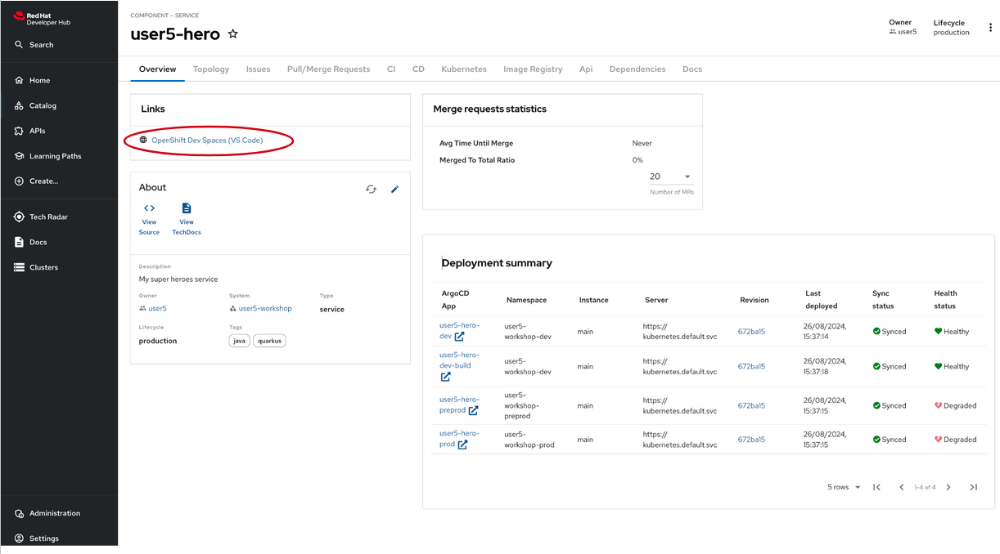

# Creating the Fight Microservice

Ok, let’s develop another microservice. We have a REST API that returns a random Hero. 
Another REST API that returns a random Villain… We need a new REST API that invokes those two, gets one random hero and one random villain and makes them fight. 
Let’s call it the Fight API.

## Bootstrapping the Fight REST Endpoint

Like for the Hero and Villain API, the easiest way to create this new Quarkus project is to use a Red Hat Developer Hub template. 

### Red Hat Developer Hub Software templates and Dev Spaces workspace.

Like the previous microservices creation, to create a Dev Spaces (DS) workspace, you'll first need to create a _Software Component_ using a _Red Hat Developer Hub (RHDH) Software Template_:

1. Navigate to the _Create Option_: in the left-hand menu of the RHDH, click on the "Create" option.
1. Select the template: you'll see a list of available templates. Choose the `OpenCodeQuest - AI-Infused application with Quarkus` template from the list.
1. Configure the workspace: after selecting the template, you'll need to provide the necessary values for clusters and other configurations. Most of these fields will be pre-filled by default, so you may only need to make minor adjustments if necessary.
1. Proceed with the setup: Once you've reviewed the configurations, proceed to create your DS workspace.

Once created, the component is available in the _catalog_.
You can access it to have an overview:



Launch the Dev Spaces creation by clicking the link OpenShift Dev Spaces (VS Code).

## The Fight Service

The Fight service is a Quarkus intelligent service. Instead of randomly selecting a winner in the battle between heroes and villains, 
he can interact with a language model (LLM) and delegate the decision to it.
Furthermore, this consultation will not only provide a winner but also a detailed description of how the fight unfolded.

First, let’s have a look at the big picture. When integrating an LLM into a Quarkus application, 
you need to describe what you want the AI to do. 
Unlike traditional code, you are going to explain the behavior of the AI using natural language. 

The following diagram illustrates the interactions between the Fight service and the LLM.


### The Quarkus-LangChain4j Extension

This extension is based on the LangChain4j library, which provides a common API to interact with LLMs. 
The LangChain4j project is a Java re-implementation of the famous langchain library.

Note that you have the in the `pom.xml` file of your Fight service:

```xml
<dependency>
    <groupId>io.quarkiverse.langchain4j</groupId>
    <artifactId>quarkus-langchain4j-openai</artifactId>
    <version>${quarkus-langchain4j.version}</version>
</dependency>
```
### Configuration

Configuring OpenAI models mandates an API key or API url among others. 
Copy the following configuration in your `application.properties` file:

```properties linenums="1" 
{{ insert('fight-service/src/main/resources/application.properties', 'aiProps') }}
```

They are self explanatory but you can check the documentation for more information.


### Defining LLM interactions

Once we have the extension, it’s time to tell the LLM what we want to do. 
The Quarkus LangChain4J extension provides a declarative way to describe LLM interactions. 
We model the interaction using an interface annotated with `@RegisterAiService`.

Create a new java interface `FightSimulatorService.java` under `src/main/java/io/quarkus/workshop/fight` and copy the following content:

```java linenums="1"
{{ insert('fight-service/src/main/java/io/quarkus/workshop/fight/FightSimulatorService.java') }}
```

The rest of the application would be able to use the LLM by injecting the FightSimulatorService interface and calling the methods.

Speaking about methods, that’s where the magic happens. 
These methods accept parameters and are annotated with `@SystemMessage` and `@UserMessage` to define instructions directed to the LLM.
You will describe what you want the LLM to do using natural language. 

The system defines the scope and initial instructions, serving as the first message sent to the LLM. 
It delineates the AI service’s role in the interaction.

#### User Message (Prompt)

The `@UserMessage` annotation defines primary instructions dispatched to the LLM. 
It typically encompasses requests and the expected response format.
As you can note, we are using a prompt template with following format. This format is expected by the model.

```
<|system|>
system prompt
<|user|>
content of the question
<|assistant|>
new line for the model's answer
```

#### Parameter Passing and Referencing
AI methods can take parameters referenced in system and user messages using the {parameter} syntax. Note the `{hero}` and `{villain}` references.

#### AI Method Return Type

The fight method returns a `FightResult`. The JSON response will be mapped to that object directly. So, let's create it. 

Create a new java record `FightResult.java` under `src/main/java/io/quarkus/workshop/fight`. Java records provide a concise way to define immutable data classes with less boilerplate code.
Once created, copy the following content:

```java linenums="1"
{{ insert('fight-service/src/main/java/io/quarkus/workshop/fight/FightResult.java') }}
```

Quarkus automatically creates an instance of FightResult from the LLM’s JSON response.

#### Fault Tolerance

The distributed nature of microservices makes external communication unreliable, increasing the need for application resiliency. 
Quarkus addresses this by offering SmallRye Fault Tolerance, based on the MicroProfile Fault Tolerance specification.

In the pom, you can see the corresponding smallrye dependencies: 

```java linenums="1"
{{ insert('fight-service/pom.xml', 'faultDep') }}
```

Then, in the code, in the `FightSimulatorService` we have a couple of annotations:


```java linenums="1"
{{ insert('fight-service/src/main/java/io/quarkus/workshop/fight/FightSimulatorService.java', 'faultToleranceAnnotation') }}
```

If the AI fails, the `@Retry` annotation ensures that the call will be retried up to two more times before finally giving up.
If a the AI query is taking too long, the `@Timeout` annotation can stop it after 1 minute, preventing it from hanging indefinitely.

### The Fight Resource

Now, to call the LLM from the application code, we well create the Fight endpoint. 
This is a JAX-RS resource just like the Hero endpoint where the FightSimulatorService will be injected. 
Finally the `fight` method is called. 

Create a new java class `FightResource.java` under `src/main/java/io/quarkus/workshop/fight` and add the following content: 

```java linenums="1"
{{ insert('fight-service/src/main/java/io/quarkus/workshop/fight/FightResource.java') }}
```

Then, create a new java class `Fight.java` under `src/main/java/io/quarkus/workshop/fight` with the following content:

```java linenums="1"
{{ insert('fight-service/src/main/java/io/quarkus/workshop/fight/Fight.java') }}
```

This is a straightforward record that encapsulates the hero and villain inputs for a fight. 
You need then the correspoding `Hero.java` and `Villain.java`:

```java linenums="1"
{{ insert('fight-service/src/main/java/io/quarkus/workshop/fight/Hero.java') }}
```

```java linenums="1"
{{ insert('fight-service/src/main/java/io/quarkus/workshop/fight/Villain.java') }}
```

## Observability 

Observability is built into services created via `@RegisterAiService` and metrics collection is enabled when quarkus-micrometer is part of the application.
Micrometer defines an API for basic meter types, like counters, gauges, timers, and distribution summaries, along with a MeterRegistry API that generalizes metrics collection and propagation for different backend monitoring systems.

Be aware that the `micrometer-registry-prometheus` extension is already present in your `pom.xml` file.

### Metrics

Each AI method is automatically timed and the timer data is available using the langchain4j.aiservices.$interface_name.$method_name template for the name.

For example, for our `FightSimulatorService` it will looks like:

### Create your own metrics

Metrics data is used in the aggregate to observe how data changes over time. Let's create a few metrics to see how battles evolve. 
We will see who is winning more times, if heroes or villains. 


Create a java class `FightMetricPublisher.java` under `src/main/java/io/quarkus/workshop/fight` containing a CDI bean as follows:

```java linenums="1"
{{ insert('fight-service/src/main/java/io/quarkus/workshop/fight/FightMetricPublisher.java') }}
```

We can see two counters there. Counters measure values that only increase. The counter is created directly on the MeterRegistry.

`fights` is the counter name and `won-by` is a tag with two possible values: `hero`or `villain`.

## Deploy the Fight microservice

To deploy the Fight service, remember to perform a commit&push of the code. You can get some help [here](from-git-to-openshif.md)