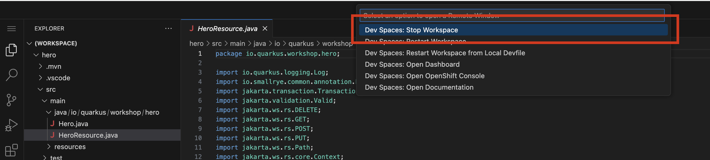

# Creating the Fight Microservice

Ok, let’s develop another microservice. 
We need a new REST API that invokes those two, gets one random hero and one random villain and makes them fight.
Let’s call it the Fight API.

## Bootstrapping the Hero Rest Endpoint

Once logged in the Red Hat Developer Hub, please proceed with following steps:

* ==Navigate to the _Create Option_: in the left-hand menu of the RHDH, click on the "Create" option==.


* ==Select the template: you'll see a list of available templates. Choose the `OpenCodeQuest - AI-Infused application with Quarkus` template from the list==.


* ==Select your cluster name, check the reference in the current url. The rest of the fields will be pre-filled by default==.


* ==Click Next button until a summary is shown==


* ==Review the configuration. Then, click on `Create`==.

* ==If everything went well, you should see the following successful page. Click on the `Open Component in Catalog`==:


* ==Once in the fight-service component home page, you can launch the Dev Spaces opening by clicking the link OpenShift Dev Spaces (VS Code)==


You should see the following page while the Dev Spaces is starting up:


## The Fight Service

The Fight service is a Quarkus intelligent service. 
Instead of randomly selecting a winner in the battle between heroes and villains, he can interact with a language model (LLM) and delegate the decision to it.
Furthermore, this consultation will not only provide a winner but also a detailed description of how the fight unfolded.

First, let’s have a look at the big picture. When integrating an LLM into a Quarkus application, 
you need to describe what you want the AI to do. 
Unlike traditional code, you are going to explain the behavior of the AI using natural language. 

The following diagram illustrates the interactions between the Fight service and the LLM.


### The Quarkus-LangChain4j Extension

This extension is based on the LangChain4j library, which provides a common API to interact with LLMs. 
The LangChain4j project is a Java re-implementation of the famous langchain library.

==Note that the extension is already present in the `pom.xml` file of your Fight service:==

```xml
<dependency>
    <groupId>io.quarkiverse.langchain4j</groupId>
    <artifactId>quarkus-langchain4j-openai</artifactId>
    <version>${quarkus-langchain4j.version}</version>
</dependency>
```
### Configuration

Configuring OpenAI models mandates an API key or API url among others.

==Copy the following configuration in your `fight-service/src/main/resources/application.properties` file:==

```properties linenums="1" 
{{ insert('fight-service/src/main/resources/application.properties', 'aiProps') }}
```

**Update the values with the ones given by your teachers.**

They are self-explanatory, but you can check the documentation for more information.

## Directory Structure

==Notice that by bootstrapping the project with the specific `OpenCodeQuest - AI-Infused application with Quarkus` template, you get the following directory structure with a few Java classes already created and other artifacts:==


It generates the following in the `fight-service` folder:

* the Maven structure with a `pom.xml`
* an `io.quarkus.workshop.fight.FightResource.java` resource exposed on `/api/fights`.
* a straightforward java Record `Fight.java` that encapsulates the hero and villain inputs for a fight.
* the corresponding `Hero.java` and `Villain.java`.
* a java Record `FightResult.java`. Quarkus automatically creates an instance of `FightResult` from the LLM’s JSON response.
* an intelligent service `FightSimulatorService.java`. This is where we will define the interaction with the LLM.
* the `application.properties` configuration file.

### Defining LLM interactions

It’s time to tell the LLM what we want to do. 
The Quarkus LangChain4J extension provides a declarative way to describe LLM interactions. 
We model the interaction using an interface annotated with `@RegisterAiService`.

==Edit the java interface `src/main/java/io/quarkus/workshop/fight/FightSimulatorService.java` and copy the following content:==

```java linenums="1"
{{ insert('fight-service/src/main/java/io/quarkus/workshop/fight/FightSimulatorService.java') }}
```

The rest of the application would be able to use the LLM by injecting the `FightSimulatorService` interface and calling the methods.

Speaking about methods, that’s where the magic happens. 
These methods accept parameters and are annotated with `@SystemMessage` and `@UserMessage` to define instructions directed to the LLM.
You should describe what you want the LLM to do using natural language. 

The system defines the scope and initial instructions, serving as the first message sent to the LLM. 
It delineates the AI service’s role in the interaction.

#### User Message (Prompt)

==Notice the presence of the `@UserMessage` annotation `FightSimulatorService`==. 
It defines primary instructions dispatched to the LLM. 
It typically encompasses requests and the expected response format.
As you can note, we are using a prompt template with following format. 
This format is expected by the model.

```
<|system|>
system prompt
<|user|>
content of the question
<|assistant|>
new line for the model's answer
```

#### Parameter Passing and Referencing
AI methods can take parameters referenced in system and user messages using the {parameter} syntax. Note the `{hero}` and `{villain}` references.

#### AI Method Return Type

The fight method returns a `FightResult`. The JSON response will be mapped to that object directly.


#### Fault Tolerance

The distributed nature of microservices makes external communication unreliable, increasing the need for application resiliency. 
Quarkus addresses this by offering SmallRye Fault Tolerance, based on the MicroProfile Fault Tolerance specification.

In the pom, you can see the corresponding smallrye dependencies: 

```java linenums="1"
{{ insert('fight-service/pom.xml', 'faultDep') }}
```

Then, in the code, ==notice the presence of the `@Timeout` annotation in the fight method==

If the LLM invocation is taking too long, the `@Timeout` annotation can stop it after 1 minute, preventing it from hanging indefinitely.

### The Fight Resource

Now, ==let's take a look to the `fight-service/src/main/java/io/quarkus/workshop/fight/FightResource.java`.==
==This is a JAX-RS resource just like the Hero endpoint where the FightSimulatorService is injected.== 
==Then the intelligent `fight` method is called from the exposed `fight` method.== 

### Start the Fight service in dev mode

We are now ready to run our application.

==Open a Terminal and run one of the following commands==:

`./mvnw quarkus:dev`

==or==

`quarkus dev`

### Verify the Fight service

==For verifying the Fight service is up and running, open the Developer Console by navigating to the $FIGHT_URL/q/dev-ui==

==Ou by clicking the `Open in New Tab` button when a pop up will be shown:==


## Deploy the Fight microservice

To deploy the Fight service, remember to perform a commit&push of the code. You can get some help [here](from-git-to-openshif.md)

Then, ==you can tag and release== your code in GitLab to promote in preprod and prod.

==Verify that everything works by navigating to the fight-ui dev url and launch a few fights between heroes and villains!==


## Observability 

Observability is built into services created via `@RegisterAiService` and metrics collection is enabled when quarkus-micrometer is part of the application.
Micrometer defines an API for basic meter types, like counters, gauges, timers, and distribution summaries, along with a MeterRegistry API that generalizes metrics collection and propagation for different backend monitoring systems.

==Be aware that the `micrometer-registry-prometheus` extension is already present in your `pom.xml` file.==

### Metrics

Each AI method is automatically timed and the timer data is available using the `langchain4j.aiservices.$interface_name.$method_name` template for the name.

### Create your own metrics

Metrics data is used in the aggregate to observe how data changes over time. 
==Metrics are already in place.==
The java class `fight-service/src/main/java/io/quarkus/workshop/fight/FightMetricPublisher.java` contains a CDI bean as follows:

```java linenums="1"
{{ insert('fight-service/src/main/java/io/quarkus/workshop/fight/FightMetricPublisher.java') }}
```

==We can see two counters there. Counters measure values that only increase. The counter is created directly on the MeterRegistry.==

==`fights` is the counter name and `won-by` is a tag with two possible values: `hero`or `villain`.==
==This counters will tell us who is winning more times, if heroes or villains.== 

Finally, ==check how the `FightMetricPublisher` is injected in the `FightResource` and called each time that a fight happen.==

### Verify metrics

The Micrometer Prometheus MeterRegistry extension creates an endpoint we can use to observe collected metrics, this endpoint is exposed in $fight-service/q/metrics path. 

Let’s take a look at the metrics that have been collected:

* ==Click on Topology tab of the fight service in Red Hat Developer Hub==


* ==Click the arrow==
* ==A new tab should open.==
* ==Add the `/q/metrics` path to the url opened in previous step. You should see the metrics. Besides some automatically generated metrics like the `http_server_requests_seconds_count` or `http_server_requests_seconds_sum`, you should also see the custom metrics counting the fights calls and how many times won the heroes and the villains:==


## Stop your DevSpaces Workspace
As you now have fully deployed your microservice, you do not need anymore the DevSpaces workspace so let's just stop it to preserve resources.

==Click the grey button **"><"** on the bottom left of DevSpaces IDE==


==Then Click "Dev Spaces : Stop Workspace==

