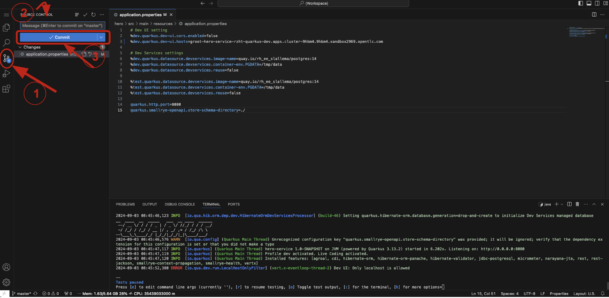

## Deploying to OpenShift cluster.

This approach will be followed for all the microservices.
With ArgoCD, deploying to the OpenShift cluster is as simple as committing and pushing your changes to the GitLab repository. 
To do this, follow these steps:

1. In Dev Spaces, go to the source control view.
2. Enter your commit message
2. Click the Commit button.

4. After committing, click the Sync button to push your changes.

This will trigger a pipeline, which you can monitor in the CI tab of the RHDH.
Once the pipeline completes successfully, you will see the corresponding pod in the Topology tab. 
From there, you can access your deployment by clicking on the pod.

