## Deploying to OpenShift cluster.

This approach will be followed for all the microservices.
With ArgoCD, deploying to the OpenShift cluster is as simple as committing and pushing your changes to the GitLab repository. 
To do this, follow these steps:

* In Dev Spaces, go to the source control view.
* Enter your commit message
* Click the Commit button.

* After committing, click the Sync Changes button to push your changes.

This action will trigger a pipeline, which you can monitor in the CI tab of the RHDH.
Once the pipeline completes successfully, you will see the corresponding pod in the Topology tab. 
From there, you can access your hero microservice by clicking on the pod.

## Exploring the pipeline

Let's switch to the Developer Hub console, in your hero component.

==Click the CI tab==

Once you commited your code, an OpenShift pipeline has been automaticaly triggered.
This pipeline was created automaticaly for your project when you instanciated the template.

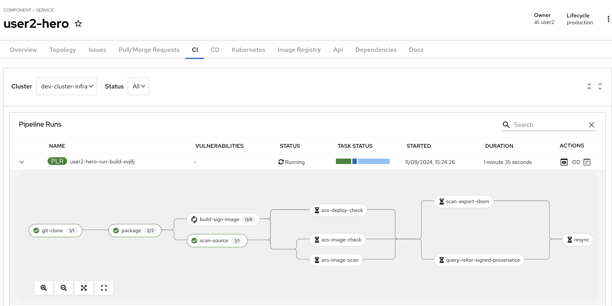

As you can see, a lot of steps are now running so let's explore a little.

The first step in the pipeline is a simple git clone. The next step is basically a mvn package and then running of Sonarqube scan-source for static analysis. All pretty standard for CI pipelines. Get the code, compile/build the code, run some scans.

### build-sign-image
It is the build-sign-image where things get super interesting.

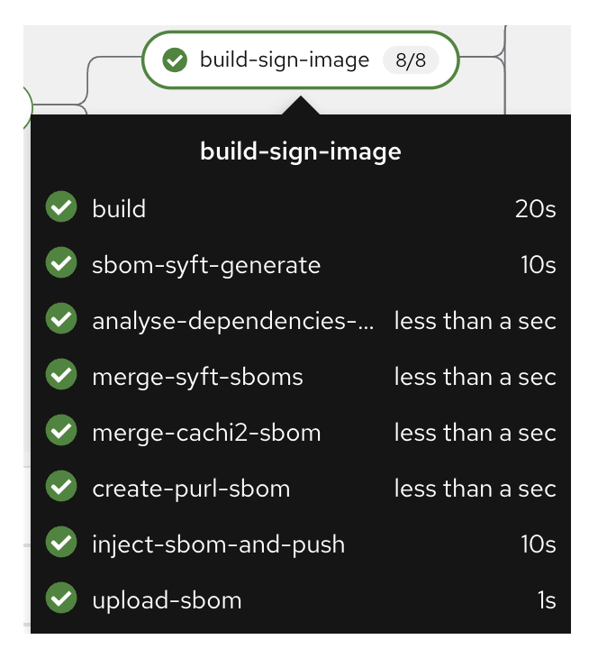

The template is leveraging Tekton Chains, a Kubernetes Custom Resource Definition (CRD) controller, that nicely augments the supply chain security within OpenShift Pipelines. This tool’s capacity to automatically sign task runs, and its adoption of advanced attestation formats like in-toto and SLA provenance, bring a higher degree of trust and verification to our processes. Tekton Chains works like an independent observer within the cluster, it signs, attests and stores additional artifacts as OCI images alongside with your container image.

Also, you can see we are using this step to automatically create a SBOM (Software Bill Of Materials) which is a kind of ingredients list for your software.

More information regarding the pipeline can be seen in next section [Trusted Application Pipeline](./trusted-apps.md)

### Dev Deployment
As a developer, I want to see my handy work, did my application really deploy to the dev environment ?

You can check that your newly built application has been automatically sync using OpenShift GitOps (ArgoCD) if you switch to the Overview Tab.

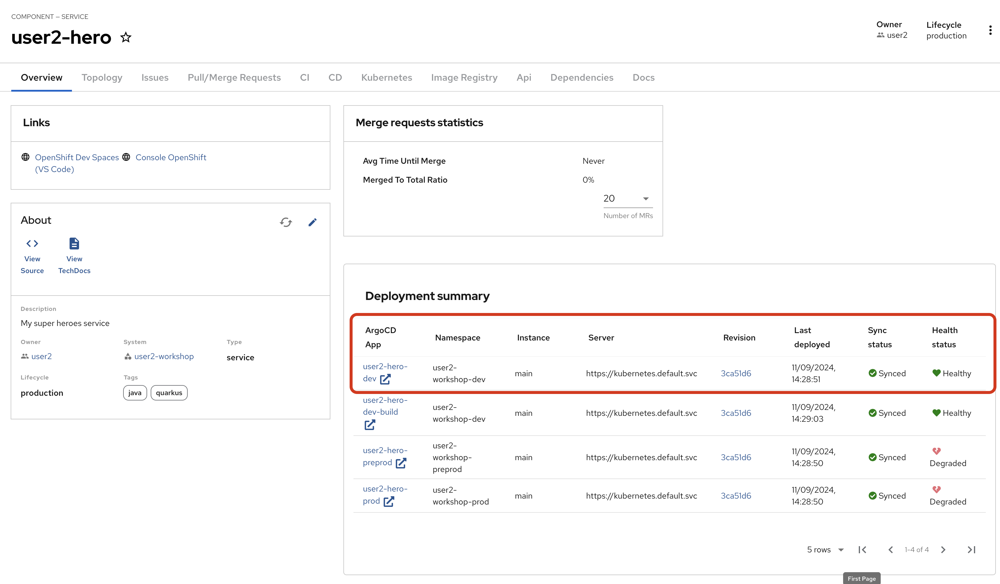

==Click on Topology==

This should look familiar to you if you regularly use the topology view from OpenShift.
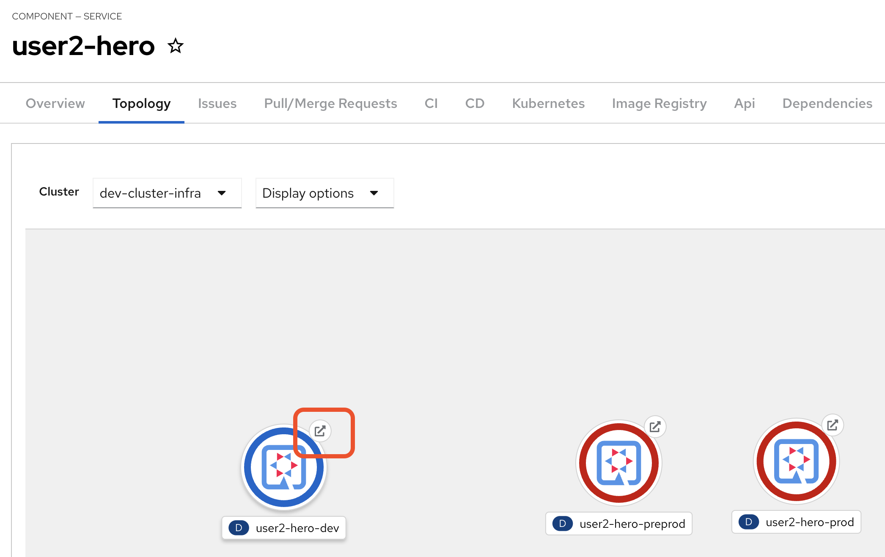

Note: pre-prod and prod have NOT yet deployed

==Click the arrow==

This will open a new tab on your browser showing your deployed hero-service !

==You can add `/api/heroes/hello` , `/api/heroes/random` or `/api/heroes` to the URL in you browser to check your work==

Note that during the deployment with OpenShift GitOps, we also deployed automatically the Database containing all the superheroes using the EDB Cluster CRD that automaticaly manage our database.

==Verify that the fight-ui dev environment is now able to retrieve the characters==

### Promote to Pre-Prod
First access the GitLab UI, there is a convenient link on ==the Overview tab==

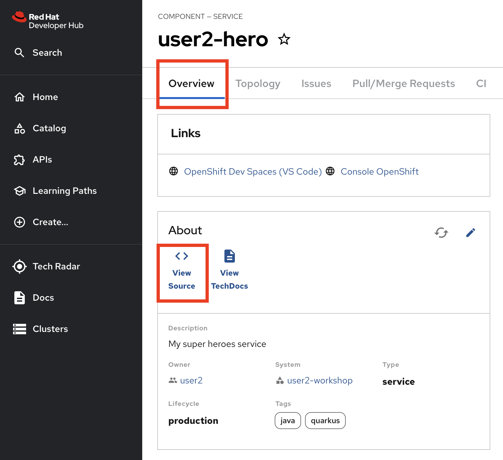

==Click on Tags==

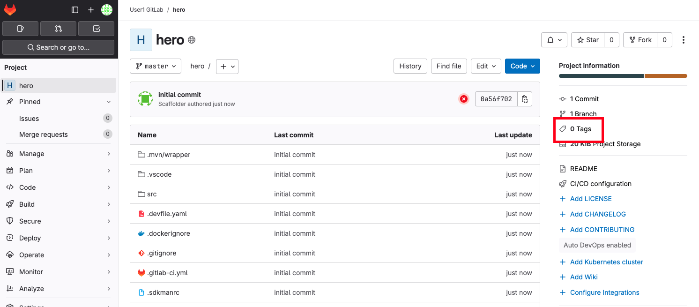

==New Tag==

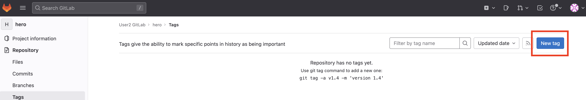

Give the tag a name like ==v1.0==

and click ==Create tag==

Back to the portal and the ==CI tab== to see the promotion pipeline in action

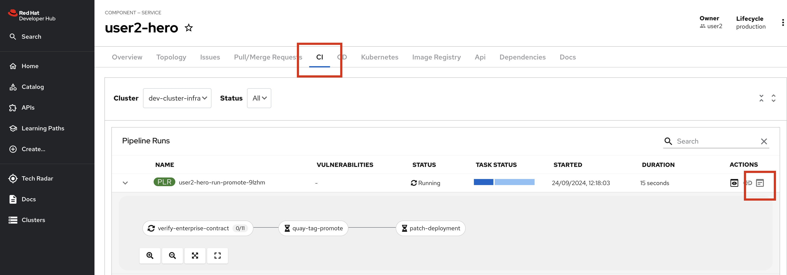

This pipeline has a special task called verify-enterprise-contract

Enterprise Contract (EC) is a special CLI that compliments Sigstore’s cosign. If you remember the build-sign-image task that produced and stored the .sig and .att artifacts into the container registry, EC evaluates that signature and attestation. EC is based on the rego policy language from Open Policy Agent and allows you to create custom rules to review cosign attest attestations. By default, EC works with the SLSA provence attestation coming out of Tekton Chains.

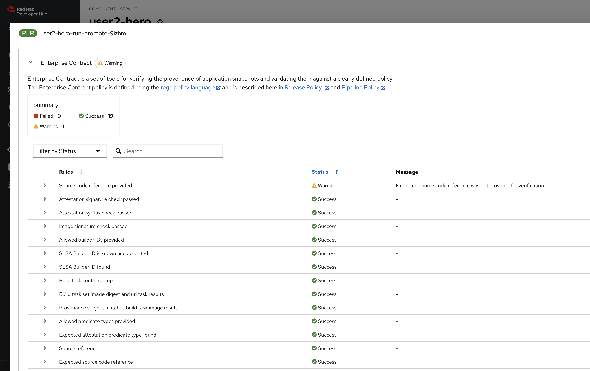

Enterprise Contract, as part of this promotion pipeline, is verifing that the container image did in fact come from the corporate standard/approved build system. In other words, this container image was not built on some random person’s laptop, it was built in the secure build system. The .att, .sbom and .sig are stored alongside the container image and a tool like skopeo can be used to move all items together.

[https://enterprisecontract.dev/](https://enterprisecontract.dev/)

[The Hitchhiker’s Guide](https://enterprisecontract.dev/docs/user-guide/main/hitchhikers-guide.html) is particularly good way to get started understanding EC.

Once the release pipeline has completed, you can see your application has been promoted to pre-prod and is available via the Topology plug-in.

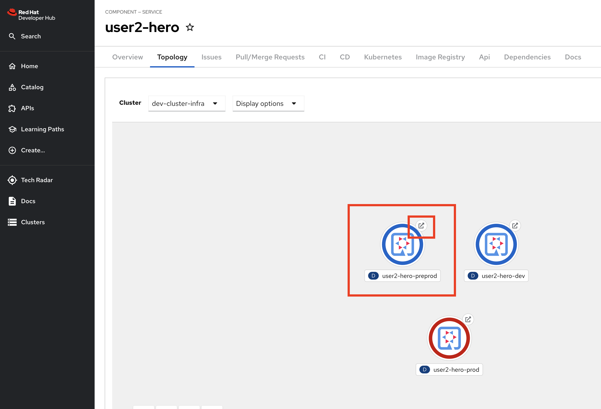

### Promote to Prod
To promote to Production use the ==Create Release feature of the GitLab UI==.

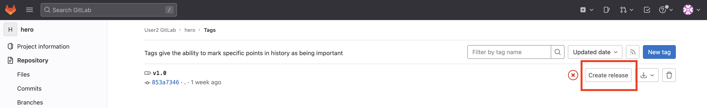

Give the release a title and click the ==Create release== button

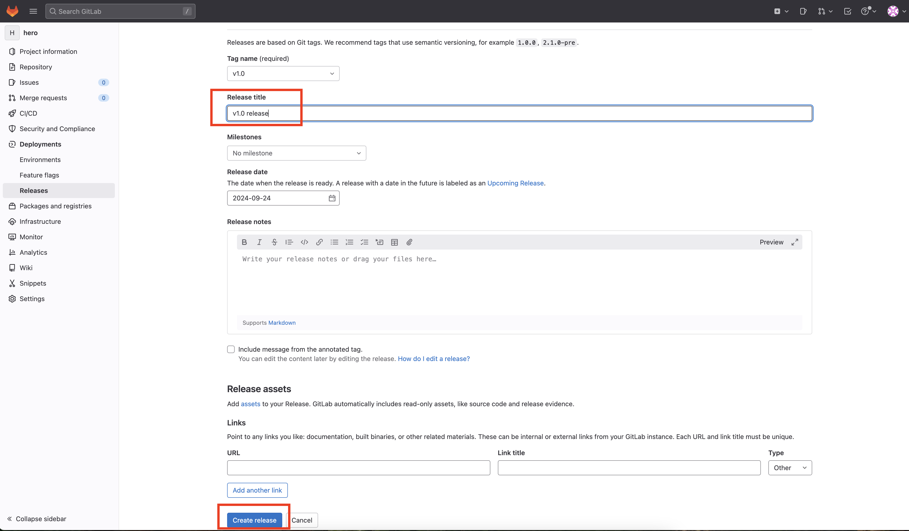

Another release pipeline will be triggered and if the Enterprise Contract passes then the container image will be promoted production.

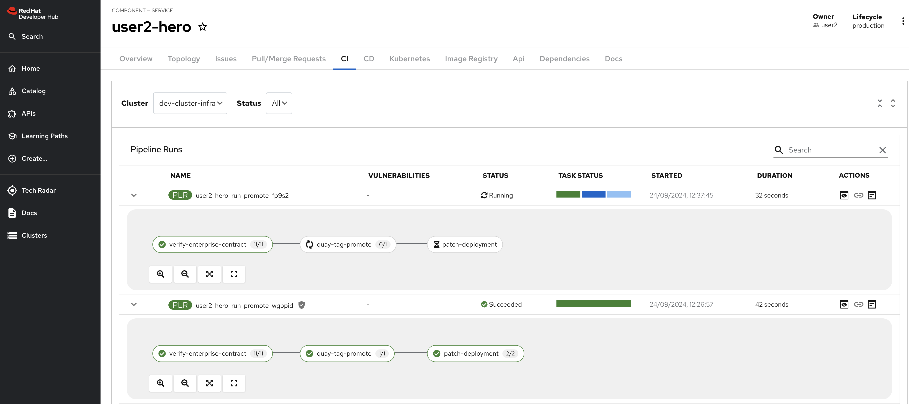

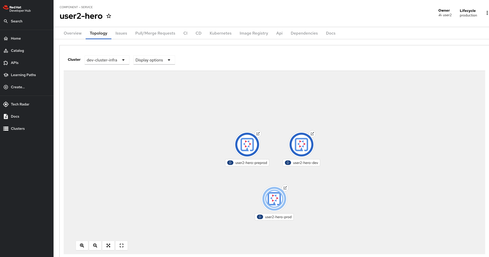

==Promotion to preprod and prod should be done for every services (villains/fight)==