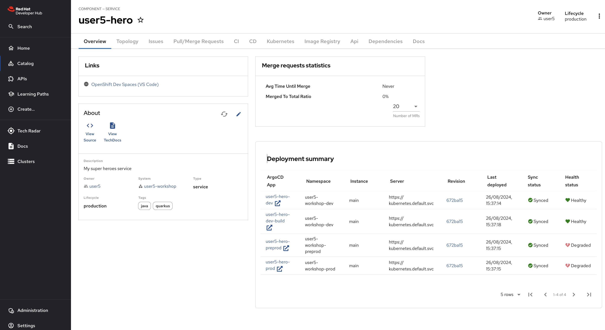

# Creating the Hero Microservice

In the following sections, you will learn:

* how to create a new _Quarkus_ application using _Red Hat Developer Hub_, and
* how to implement REST API using JAX-RS, and
* how to compose your application using CDI beans, and
* how to access your database using Hibernate with Panache, and
* how to use transactions, and

## Bootstrapping the Hero Rest Endpoint

### Red Hat Developer Hub Software templates and Dev Spaces workspace.  

To create a Dev Spaces (DS) workspace, you'll first need to create a _Software Component_ using a _Red Hat Developer Hub (RHDH) Software Template_:

1. Navigate to the _Create Option_: in the left-hand menu of the RHDH, click on the "Create" option.
1. Select the template: you'll see a list of available templates. Choose the `OpenCodeQuest - Quarkus with Postgresql` template from the list.
1. Configure the workspace: after selecting the template, you'll need to provide the necessary values for clusters and other configurations. Most of these fields will be pre-filled by default, so you may only need to make minor adjustments if necessary.
1. Proceed with the setup: Once you've reviewed the configurations, proceed to create your DS workspace.

Once created, the component is available in the _catalog_.
You can access it to have an overview:



Launch the Dev Spaces creation by clicking the link OpenShift Dev Spaces (VS Code).

## The Hero Service

At the heart of the Super Hero application come _heroes_.

We need to expose a REST API allowing CRUD operations on _super heroes_.
This microservice is, let’s say, a *classical* microservice.
It uses HTTP to expose a REST API, and it internally stores data into a database.

This service will be used by the *fight* microservice.


First, let’s describe our service. The Super Heroes microservice stores super-heroes, with their names, powers, and so on.
The REST API allows adding, removing, listing, and picking a random hero from the stored set.

Nothing outstanding but a good first step to discover Quarkus.

## Directory Structure

Once you bootstrap the project, you get the following directory structure with a few Java classes and other artifacts:


It generates the following in the `hero-service` folder:

* the Maven structure with a `pom.xml`
* an `io.quarkus.workshop.hero.HeroResource` resource exposed on `/api/heroes`
* an associated unit test `HeroResourceTest`
* the landing page `index.html` that is accessible after starting the application
* example `Dockerfile` files for both native and jvm modes in `src/main/docker`
* the `application.properties` configuration file

Once generated, look at the `pom.xml`.
You will find the here import of the Quarkus BOM (_bill of materials_), allowing you to omit the version on the different Quarkus dependencies.
In addition, you can see the `quarkus-maven-plugin`, responsible for the packaging of the application and also providing the development mode support.

If we focus on the dependencies section, you can see the extension allowing the development of REST applications:

## The JAX-RS Resource

During the project creation, the `HeroResource.java` file has been created with the following content:

```java linenums="1"
{{ insert('hero-service/src/main/java/io/quarkus/workshop/hero/HeroResource.java', 'docHeroResource', 'docHeroCrudContent') }}
```

It's a very simple REST endpoint, returning "hello" to HTTP GET requests to `/api/heroes`.


## Running the Application

We are now ready to run our application.

You can use either the Quarkus or Apache Maven command-line interface in a Terminal.
Open a Terminal by clicking on the hamburger menu (three horizontal lines) located in the upper-left corner of the screen.
Navigate to Terminal and select New Terminal from the dropdown menu.

Then, run one of the following commands: 

`./mvnw quarkus:dev`

or 

`quarkus dev`

```shell
$  quarkus dev
[INFO] Scanning for projects...
[INFO] 
[INFO] ------------------< com.redhat.workshop:hero-service >------------------
[INFO] Building hero-service 1.0-SNAPSHOT
[INFO]   from pom.xml
[INFO] --------------------------------[ jar ]---------------------------------
[INFO] 
[INFO] --- quarkus:3.13.2:dev (default-cli) @ hero-service ---
[INFO] Invoking resources:3.3.1:resources (default-resources) @ hero-service
[INFO] Copying 2 resources from src/main/resources to target/classes
[INFO] Invoking quarkus:3.13.2:generate-code (default) @ hero-service
[INFO] Invoking compiler:3.13.0:compile (default-compile) @ hero-service
[INFO] Nothing to compile - all classes are up to date.
[INFO] Invoking resources:3.3.1:testResources (default-testResources) @ hero-service
[INFO] skip non existing resourceDirectory /projects/hero/src/test/resources
[INFO] Invoking quarkus:3.13.2:generate-code-tests (default) @ hero-service
[INFO] Invoking compiler:3.13.0:testCompile (default-testCompile) @ hero-service
[INFO] Nothing to compile - all classes are up to date.

----------------------------
--- Help improve Quarkus ---
----------------------------
* Learn more: https://quarkus.io/usage/
* Do you agree to contribute anonymous build time data to the Quarkus community? (y/n and enter) 
[info] [Quarkus build analytics] Didn't receive the user's answer after 10 seconds. The question will be asked again next time.

Listening for transport dt_socket at address: 5005
2024-08-28 11:39:46,023 INFO  [io.qua.dat.dep.dev.DevServicesDatasourceProcessor] (build-21) Dev Services for default datasource (postgresql) started - container ID is b64fe935733f
2024-08-28 11:39:46,026 INFO  [io.qua.hib.orm.dep.dev.HibernateOrmDevServicesProcessor] (build-34) Setting quarkus.hibernate-orm.database.generation=drop-and-create to initialize Dev Services managed database
__  ____  __  _____   ___  __ ____  ______ 
 --/ __ \/ / / / _ | / _ \/ //_/ / / / __/ 
 -/ /_/ / /_/ / __ |/ , _/ ,< / /_/ /\ \   
--\___\_\____/_/ |_/_/|_/_/|_|\____/___/   
2024-08-28 11:39:46,603 WARN  [io.qua.config] (Quarkus Main Thread) Unrecognized configuration key "quarkus.smallrye-openapi.store-schema-directory" was provided; it will be ignored; verify that the dependency extension for this configuration is set or that you did not make a typo
2024-08-28 11:39:48,103 WARN  [org.hib.eng.jdb.spi.SqlExceptionHelper] (JPA Startup Thread) SQL Warning Code: 0, SQLState: 00000
2024-08-28 11:39:48,105 WARN  [org.hib.eng.jdb.spi.SqlExceptionHelper] (JPA Startup Thread) table "myentity" does not exist, skipping
2024-08-28 11:39:48,106 WARN  [org.hib.eng.jdb.spi.SqlExceptionHelper] (JPA Startup Thread) SQL Warning Code: 0, SQLState: 00000
2024-08-28 11:39:48,106 WARN  [org.hib.eng.jdb.spi.SqlExceptionHelper] (JPA Startup Thread) sequence "myentity_seq" does not exist, skipping
2024-08-28 11:39:48,316 INFO  [io.quarkus] (Quarkus Main Thread) hero-service 1.0-SNAPSHOT on JVM (powered by Quarkus 3.13.2) started in 7.445s. Listening on: http://0.0.0.0:8080
2024-08-28 11:39:48,317 INFO  [io.quarkus] (Quarkus Main Thread) Profile dev activated. Live Coding activated.
2024-08-28 11:39:48,317 INFO  [io.quarkus] (Quarkus Main Thread) Installed features: [agroal, cdi, hibernate-orm, hibernate-orm-panache, hibernate-validator, jdbc-postgresql, micrometer, narayana-jta, rest, rest-jackson, smallrye-context-propagation, smallrye-health, vertx]

--
Tests paused
Press [e] to edit command line args (currently ''), [r] to resume testing, [o] Toggle test output, [:] for the terminal, [h] for more options>
```

Then check that the endpoint returns `hello` as expected:

```shell
$ curl $URL/api/heroes
Hello from Quarkus REST
```

where `$URL` is the running service endpoint (host + port number).

Alternatively, you can open `$URL/api/heroes` in your browser.

## Development Mode

`quarkus:dev` runs Quarkus in development mode.
This enables hot deployment with background compilation, which means that when you modify your Java files and/or your resource files and invoke a REST endpoint (i.e. cUrl command or refresh your browser), these changes will automatically take effect.

This works as well for resource files like the configuration property and HTML files.
Refreshing the browser triggers a scan of the workspace, and if any changes are detected, the Java files are recompiled and the application is redeployed;
your request is then serviced by the redeployed application.
If there are any issues with compilation or deployment an error page will let you know.

The development mode also allows debugging and listens for a debugger on port 5005.
If you want to wait for the debugger to attach before running you can pass `-Dsuspend=true` on the command line.
If you don't want the debugger at all you can use `-Ddebug=false`.

Alright, time to change some code.
Open your favorite IDE and import the project.
To check that the hot reload is working, update the method `HeroResource.hello()` by returning the String "hello hero".
Now, execute the cUrl command again, the output has changed without you to having to stop and restart Quarkus:

## Testing the Application

So far so good, but wouldn't it be better with a few tests, just in case?

In the generated `pom.xml` file, you can see 2 test dependencies:

```xml
<dependency>
    <groupId>io.quarkus</groupId>
    <artifactId>quarkus-junit5</artifactId>
    <scope>test</scope>
</dependency>
<dependency>
    <groupId>io.rest-assured</groupId>
    <artifactId>rest-assured</artifactId>
    <scope>test</scope>
</dependency>

```

Quarkus supports JUnit 4 and JUnit 5 tests.
In the generated project, we use JUnit 5.

We also set the `java.util.logging` system property to make sure tests will use the correct log manager.

```xml
<plugin>
    <artifactId>maven-surefire-plugin</artifactId>
    <version>${surefire-plugin.version}</version>
    <configuration>
        <systemPropertyVariables>
            <java.util.logging.manager>org.jboss.logmanager.LogManager</java.util.logging.manager>
            <maven.home>${maven.home}</maven.home>
        </systemPropertyVariables>
    </configuration>
</plugin>
```

The generated project contains a simple test in `HeroResourceTest.java`.

```java linenums="1"
{{ insert('hero-service/src/test/java/io/quarkus/workshop/hero/HeroResourceTest.java', 'docHeroResourceTest', 'docCrudTests') }}
```

By using the `QuarkusTest` runner, the `HeroResourceTest` class instructs JUnit to start the application before the tests.
Then, the `testHelloEndpoint` method checks the HTTP response status code and content.

Notice that these tests use RestAssured, but feel free to use your favorite library.

Execute it with `./mvnw test` or from your IDE.

### Continuous testing

Quarkus supports continuous testing, where tests run immediately after code changes have been saved. 
This allows you to get instant feedback on your code changes. 

Quarkus detects which tests cover which code, and uses this information to only run the relevant tests when code is changed.
When you start Quarkus in dev mode, down the bottom of the screen you should see the following:

```shell
Tests paused, press [r] to resume, [h] for more options>
```
Press r and the tests will start running. You should see the status change down the bottom of the screen as they are running, and it should finish with:

```shell
All 1 test is passing (0 skipped), 1 test was run in 8053ms. Tests completed at 12:11:25.
Press [e] to edit command line args (currently ''), [r] to re-run, [o] Toggle test output, [:] for the terminal, [h] for more options>
```

## Packaging and Running the Application

The application is packaged using `./mvnw package` or `quarkus build`.
It produces 2 jar files in `/target`:

* `rest-hero-1.0-SNAPSHOT.jar`: containing just the classes and resources of the projects, it's the regular artifact produced by the Maven build;
* `quarkus-app/quarkus-run.jar`: being an executable jar.
  Be aware that it's not an über-jar as the dependencies are copied into the `target/quarkus-app/lib` directory.

The application is now runnable from a terminal by running `java -jar target/quarkus-app/quarkus-run.jar`. 
