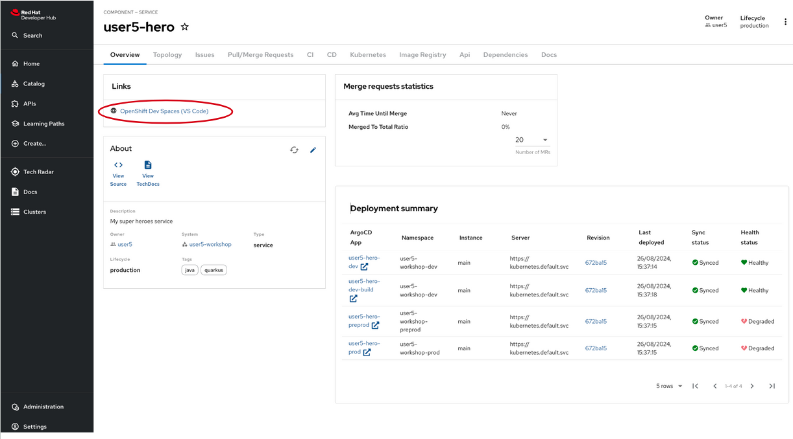
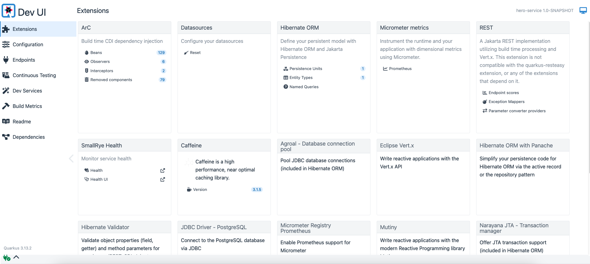

# Creating the Hero Microservice

## Bootstrapping the Hero Rest Endpoint

Once logged in the Red Hat Developer Hub, please proceed with following steps:

* ==Navigate to the _Create Option_: in the left-hand menu of the RHDH, click on the "Create" option==.


* ==Select the template: you'll see a list of available templates. Choose the `OpenCodeQuest - Quarkus CRUD microservice` template from the list==.


* ==Select your cluster name, check the reference in the current url. The rest of the fields will be pre-filled by default==.


* ==Click Next button until a summary is shown==


* ==Review the configuration. Then, click on `Create`==.

* ==If everything went well, you should see the following successful page. Click on the `Open Component in Catalog`==:


* ==Once in the hero-service component home page, you can launch the Dev Spaces opening by clicking the link OpenShift Dev Spaces (VS Code)==



You may be asked to authenticate again. Please, proceed. 
You should see the following page while the Dev Spaces is starting up:


## The Hero Service

The Super Heroes microservice stores super-heroes, with their names, powers, and so on.
We need to expose a REST API allowing CRUD operations on _super heroes_.
This microservice is a *classical* microservice.
It uses HTTP to expose a REST API, and it internally stores data into a database.

This service will be used by the *fight* microservice.


## Directory Structure

Once you bootstrap the project, you get the following directory structure with a few Java classes and other artifacts:


It generates the following in the `hero-service` folder:

* the Maven structure with a `pom.xml`
* an `io.quarkus.workshop.hero.HeroResource` resource exposed on `/api/heroes`
* an associated unit test `HeroResourceTest`
* the landing page `index.html` that is accessible after starting the application
* the `application.properties` configuration file

==Look at the `pom.xml`==.
You will find here the import of the Quarkus BOM (_bill of materials_), allowing you to omit the version on the different Quarkus dependencies.
In addition, you can see the `quarkus-maven-plugin`, responsible for the packaging of the application and also providing the development mode support.

Regarding the dependencies section, you can see the extension allowing the development of REST applications.

## The JAX-RS Resource

During the project creation, the `hero-service/src/main/java/io/quarkus/workshop/hero/HeroResource.java` file has been created with the following content:

```java linenums="1"
{{ insert('hero-service/src/main/java/io/quarkus/workshop/hero/HeroResource.java', 'docHeroResource', ['docHeroCrudContent']) }}
```

It's a very simple REST endpoint, returning "hello" to HTTP GET requests to `/api/heroes`.

## Running the Application

We are now ready to run our application.

You can use either the `quarkus` cli or `Apache Maven` command-line interface in a Terminal.

==Open a Terminal by clicking on the hamburger menu (three horizontal lines) located in the upper-left corner of the screen.==
==Navigate to Terminal and select New Terminal from the dropdown menu.==

==Then, run one of the following commands==: 

`./mvnw quarkus:dev`

==or== 

`quarkus dev`

```shell
$  quarkus dev
[INFO] Scanning for projects...
[INFO] 
[INFO] ------------------< com.redhat.workshop:hero-service >------------------
[INFO] Building hero-service 1.0-SNAPSHOT
[INFO]   from pom.xml
[INFO] --------------------------------[ jar ]---------------------------------
[INFO] 
[INFO] --- quarkus:3.13.2:dev (default-cli) @ hero-service ---
[INFO] Invoking resources:3.3.1:resources (default-resources) @ hero-service
[INFO] Copying 2 resources from src/main/resources to target/classes
[INFO] Invoking quarkus:3.13.2:generate-code (default) @ hero-service
[INFO] Invoking compiler:3.13.0:compile (default-compile) @ hero-service
[INFO] Nothing to compile - all classes are up to date.
[INFO] Invoking resources:3.3.1:testResources (default-testResources) @ hero-service
[INFO] skip non existing resourceDirectory /projects/hero/src/test/resources
[INFO] Invoking quarkus:3.13.2:generate-code-tests (default) @ hero-service
[INFO] Invoking compiler:3.13.0:testCompile (default-testCompile) @ hero-service
[INFO] Nothing to compile - all classes are up to date.

----------------------------
--- Help improve Quarkus ---
----------------------------
* Learn more: https://quarkus.io/usage/
* Do you agree to contribute anonymous build time data to the Quarkus community? (y/n and enter) 
[info] [Quarkus build analytics] Didn't receive the user's answer after 10 seconds. The question will be asked again next time.

Listening for transport dt_socket at address: 5005
2024-08-28 11:39:46,023 INFO  [io.qua.dat.dep.dev.DevServicesDatasourceProcessor] (build-21) Dev Services for default datasource (postgresql) started - container ID is b64fe935733f
2024-08-28 11:39:46,026 INFO  [io.qua.hib.orm.dep.dev.HibernateOrmDevServicesProcessor] (build-34) Setting quarkus.hibernate-orm.database.generation=drop-and-create to initialize Dev Services managed database
__  ____  __  _____   ___  __ ____  ______ 
 --/ __ \/ / / / _ | / _ \/ //_/ / / / __/ 
 -/ /_/ / /_/ / __ |/ , _/ ,< / /_/ /\ \   
--\___\_\____/_/ |_/_/|_/_/|_|\____/___/   
2024-08-28 11:39:46,603 WARN  [io.qua.config] (Quarkus Main Thread) Unrecognized configuration key "quarkus.smallrye-openapi.store-schema-directory" was provided; it will be ignored; verify that the dependency extension for this configuration is set or that you did not make a typo
2024-08-28 11:39:48,103 WARN  [org.hib.eng.jdb.spi.SqlExceptionHelper] (JPA Startup Thread) SQL Warning Code: 0, SQLState: 00000
2024-08-28 11:39:48,105 WARN  [org.hib.eng.jdb.spi.SqlExceptionHelper] (JPA Startup Thread) table "myentity" does not exist, skipping
2024-08-28 11:39:48,106 WARN  [org.hib.eng.jdb.spi.SqlExceptionHelper] (JPA Startup Thread) SQL Warning Code: 0, SQLState: 00000
2024-08-28 11:39:48,106 WARN  [org.hib.eng.jdb.spi.SqlExceptionHelper] (JPA Startup Thread) sequence "myentity_seq" does not exist, skipping
2024-08-28 11:39:48,316 INFO  [io.quarkus] (Quarkus Main Thread) hero-service 1.0-SNAPSHOT on JVM (powered by Quarkus 3.13.2) started in 7.445s. Listening on: http://0.0.0.0:8080
2024-08-28 11:39:48,317 INFO  [io.quarkus] (Quarkus Main Thread) Profile dev activated. Live Coding activated.
2024-08-28 11:39:48,317 INFO  [io.quarkus] (Quarkus Main Thread) Installed features: [agroal, cdi, hibernate-orm, hibernate-orm-panache, hibernate-validator, jdbc-postgresql, micrometer, narayana-jta, rest, rest-jackson, smallrye-context-propagation, smallrye-health, vertx]

--
Tests paused
Press [e] to edit command line args (currently ''), [r] to resume testing, [o] Toggle test output, [:] for the terminal, [h] for more options>
```

At some point, a pop up asking for opening the Quarkus dev will be shown:


==Click on the `Open in New Tab` button.==

You can now check that the endpoint returns `Hello from Quarkus REST` as expected.

==Open a new Terminal and run the following command==

```shell
curl http://localhost:8080/api/heroes/hello
```

## Development Mode

`mvn quarkus:dev` or `quarkus dev` runs Quarkus in development mode.
This enables hot deployment with background compilation, which means that when you modify your Java files and/or your resource files and invoke a REST endpoint (i.e. cUrl command or refresh your browser), these changes will automatically take effect.
If there are any issues with compilation an error page will let you know.

The development mode also allows debugging and listens for a debugger on port 5005.

### Dev UI

Quarkus ships with a Developer UI, which is available in dev mode at /q/dev-ui path by default.
It will show you something like this:



It allows you to:

* quickly visualize all the extensions currently loaded
* view extension statuses and go directly to extension documentation
* view and change Configuration
* manage and visualize Continuous Testing
* view Dev Services information
* view the Build information
* view and stream various logs

Each extension used in the application will be listed

==Open the Developer Console by navigating to the $HERO_URL/q/dev-ui== 

## Testing the Application

So far so good, but wouldn't it be better with a few tests, just in case?

In the generated `pom.xml` file, you can see 2 test dependencies:

```xml
<dependency>
    <groupId>io.quarkus</groupId>
    <artifactId>quarkus-junit5</artifactId>
    <scope>test</scope>
</dependency>
<dependency>
    <groupId>io.rest-assured</groupId>
    <artifactId>rest-assured</artifactId>
    <scope>test</scope>
</dependency>

```
The generated project contains a simple test in `hero-service/src/test/java/io/quarkus/workshop/hero/HeroResourceTest.java`.

```java linenums="1"
{{ insert('hero-service/src/test/java/io/quarkus/workshop/hero/HeroResourceTest.java', 'docHeroResourceTest', ['docCrudTests','docHelloPath']) }}
```

By using the `QuarkusTest` runner, the `HeroResourceTest` class instructs JUnit to start the application before the tests.
Then, the `testHelloEndpoint` method checks the HTTP response status code and content.

You can running the tests with `./mvnw test` in a new Terminal.

### Continuous testing

Quarkus supports continuous testing, where tests run immediately after code changes have been saved. 
This allows you to get instant feedback on your code changes.

==When you start Quarkus in dev mode, down the bottom of the screen you should see the following==:

```shell
Tests paused, press [r] to resume, [h] for more options>
```
==Press `r and the tests will start running.==
==You should see the status change down the bottom of the screen as they are running, and it should finish with:==

```shell
All 1 test is passing (0 skipped), 1 test was run in 8053ms. Tests completed at 12:11:25.
Press [e] to edit command line args (currently ''), [r] to re-run, [o] Toggle test output, [:] for the terminal, [h] for more options>
```