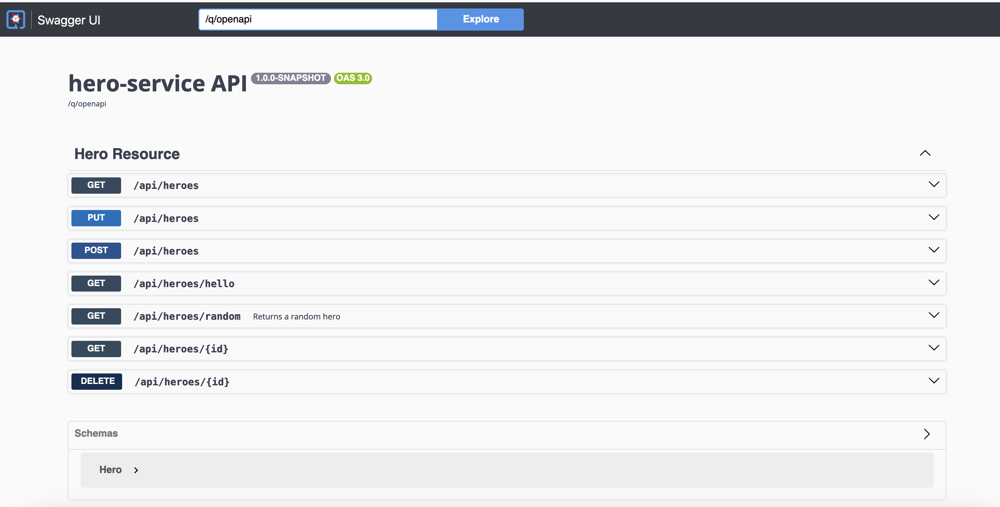

By default, a Quarkus application exposes its API description through an OpenAPI specification.
Quarkus also lets you test it via a user-friendly UI named Swagger UI.

### Open API Dependency

Quarkus proposes a smallrye-openapi extension compliant with the Eclipse MicroProfile OpenAPI specification in order to generate your API OpenAPI specification.

==The OpenAPI dependency __is already present__ in the `pom.xml` of the hero-service. Check it out:==

```java linenums="1"
{{ insert('hero-service/pom.xml', 'docOpenApiDependency') }}
```
Now, you can curl the openapi endpoint and get the API description of the HeroResource.

==In a Terminal, run the following command==

```shell
curl http://localhost:8080/q/openapi
```

You should have something like:

```shell
---
openapi: 3.0.3
info:
  title: hero-service API
  version: 1.0.0-SNAPSHOT
paths:
  /api/heroes:
    get:
      tags:
      - Hero Resource
      responses:
        "200":
          description: OK
          content:
            application/json:
              schema:
                type: array
                items:
                  $ref: "#/components/schemas/Hero"
    put:
      tags:
      - Hero Resource
      requestBody:
        content:
          application/json:
            schema:
              $ref: "#/components/schemas/Hero"
      responses:
        "200":
          description: OK
          content:
            application/json:
              schema:
                $ref: "#/components/schemas/Hero"
    post:
      tags:
      - Hero Resource
      requestBody:
        content:
          application/json:
            schema:
              $ref: "#/components/schemas/Hero"
      responses:
        "200":
          description: OK
          content:
            application/json:
              schema:
                format: uri
                type: string
  /api/heroes/hello:
    get:
      tags:
      - Hero Resource
      responses:
        "200":
          description: OK
          content:
            text/plain:
              schema:
                type: string
  /api/heroes/random:
    get:
      tags:
      - Hero Resource
      responses:
        "200":
          description: OK
          content:
            application/json:
              schema:
                $ref: "#/components/schemas/Hero"
  /api/heroes/{id}:
    get:
      tags:
      - Hero Resource
      parameters:
      - name: id
        in: path
        required: true
        schema:
          format: int64
          type: integer
      responses:
        "200":
          description: OK
          content:
            application/json:
              schema:
                $ref: "#/components/schemas/Hero"
    delete:
      tags:
      - Hero Resource
      parameters:
      - name: id
        in: path
        required: true
        schema:
          format: int64
          type: integer
      responses:
        "204":
          description: No Content
components:
  schemas:
    Hero:
      required:
      - name
      - level
      type: object
      properties:
        id:
          format: int64
          type: integer
        name:
          maxLength: 50
          minLength: 3
          type: string
        otherName:
          type: string
        level:
          format: int32
          minimum: 1
          type: integer
        picture:
          type: string
        powers:
          type: string

```

## Swagger UI 

When building APIs, developers want to test them quickly. 
Swagger UI is a great tool permitting to visualize and interact with your APIs.
The UI is automatically generated from your OpenAPI specification. 
The Quarkus smallrye-openapi extension comes with a swagger-ui extension embedding a properly configured Swagger UI page. 


==The Swagger UI is accessible from the Red Hat Developer Hub, in the hero component dashboard, just click on the `Api` tab:==


==Then, select the `$USER-hero` provided API==


==And, finally, click in the `Definition` tab== 


Here you can see the Swagger UI for Heroes API.

By default, Swagger UI is also accessible at $URL/q/swagger-ui endpoint. 
So, once your application is started in dev mode, you can navigate with a browser to $URL/q/swagger-ui and play with your API.




Ok, now, before continuing with the workshop...

<div class="grid cards" markdown>
-   :warning:{ .lg .middle }:warning:{ .lg .middle } __Stop the dev mode__ :warning:{ .lg .middle }:warning:{ .lg .middle }

    ---

    Please stop the hero-service launched in dev mode otherwise you will get a conflict port error.
</div>
