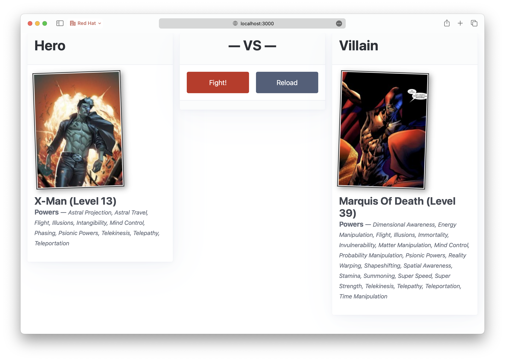
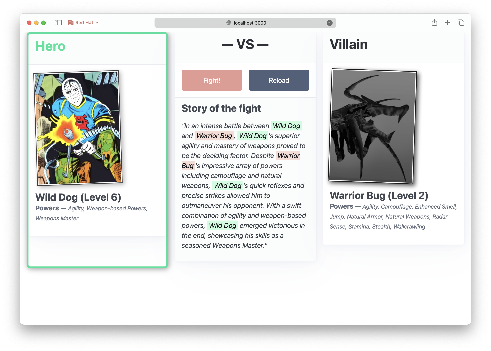

# Overview

This workshop illustrates how to build intelligent applications using:

- [Red Hat OpenShift](https://www.openshift.com/)
- [Red Hat OpenShift AI/ML Services](https://www.openshift.com/ai-ml)
- [Quarkus](https://quarkus.io/)
- [Red Hat Developer Hub](https://developers.redhat.com/rhdh/overview)
- [Red Hat Trusted Application Pipelines](https://www.redhat.com/en/products/trusted-application-pipelines)

This workshop covers both the development and deployment of such applications on OpenShift as well as the integration with OpenShift AI/ML Services.

It proposes a _platform engineering_ approach to the development of intelligent applications.
Thus, the code is developed in _CodeSpaces_ and the deployment is done using _Trusted Application Pipelines_.
The different application components run in OpenShift.

# The application

In this workshop you will develop an application that allows super-heroes to fight against villains. 

Being a workshop about microservices, you will be developing several microservices communicating synchronously via REST API endpoints:

- `frontend`: a web application that allows users to pick up a random super-hero, a random villain and makes them fight. The Super Hero UI invokes the Hero, Villain and Fight REST endpoints.
- `hero-service`: a Quarkus microservice that provides CRUD operations on Heroes which are stored in a PostgresSQL database.
- `villain-service`: the counterpart of the hero service, for villains.
- `fight-service`: a microservice that simulates a fight between a hero and a villain. The simulation is done using a _Large Language Model_ (LLM) that is deployed on OpenShift AI/ML Services. The result also includes a short narration of the fight:

# The architecture

!!! note "Hero and Villain services"
    The `hero-service` and `villain-service` are very similar, yet they use different _development models_. While both are Quarkus applications, the hero service uses the idiomatic Quarkus development model, while the villain service uses the Spring compatibility support from Quarkus.

