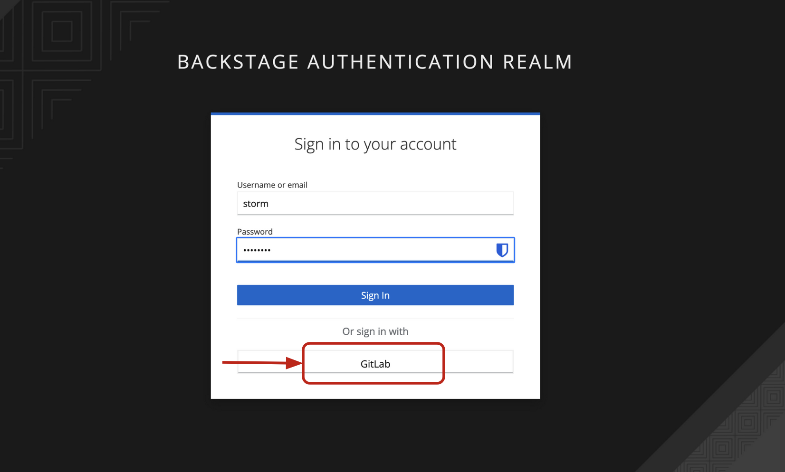
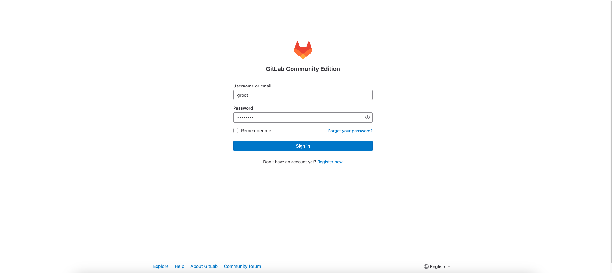

# Software Requirements

First of all, make sure you have Web browser installed on your laptop and internet connectivity.

Your environment is remote and can be accessed via Red Hat Developer Hub through your local browser, you just need to navigate to the url available on the physical card you have been done and sign in using the credentials.
Your environment includes:
- Dev Spaces: an in-browser IDE for rapid cloud application development. This where you are going to write Java code.
- OpenShift Container Platform: an OpenShift cluster where you are going to deploy the Quarkus microservices.
- ...

## Access to Red Hat Developer Hub (RHDH)

Go to the RHDH url. A login page should be shown.

Introduce the login and password provided and select GitLab as Sign In mode. You should be redirect to the GitLab authentication page.

Tape the login and password provided again. The Red Hat Developer Hub home page should be displayed.

This page shows an overview of your environnement with all the tools available.

