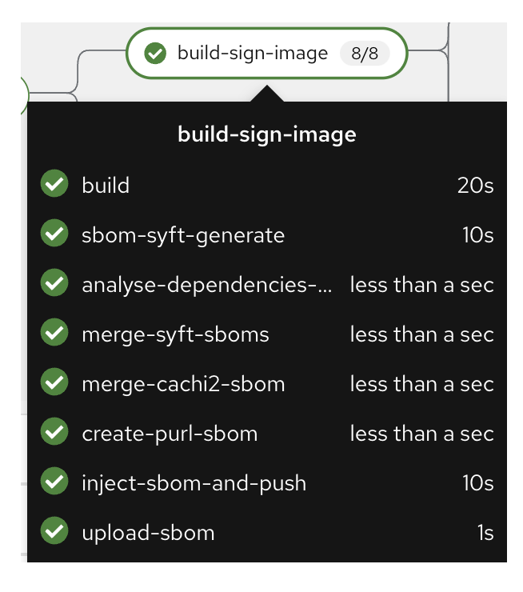
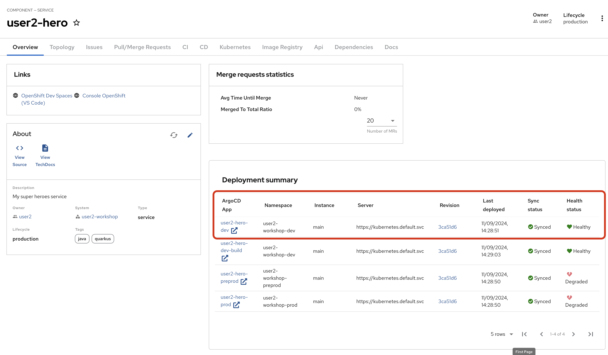

Red Hat Trusted Application Pipelines is a set of Red Hat products able to build secured pipelines by signing and verify your build artifacts.

## Exploring the pipeline

Let's switch to the Developer Hub console, in your hero component.

==Click the CI tab==

Once you commited your code, an OpenShift pipeline has been automaticaly triggered.
This pipeline was created automaticaly for your project when you instanciated the template.

As you can see, a lot of steps are now running so let's explore a little.

The first step in the pipeline is a simple git clone. The next step is basically a mvn package and then running of Sonarqube scan-source for static analysis. All pretty standard for CI pipelines. Get the code, compile/build the code, run some scans.

### build-sign-image
It is the build-sign-image where things get super interesting.

The template is leveraging Tekton Chains, a Kubernetes Custom Resource Definition (CRD) controller, that nicely augments the supply chain security within OpenShift Pipelines. This tool’s capacity to automatically sign task runs, and its adoption of advanced attestation formats like in-toto and SLA provenance, bring a higher degree of trust and verification to our processes. Tekton Chains works like an independent observer within the cluster, it signs, attests and stores additional artifacts as OCI images alongside with your container image.

Also, you can see we are using this step to automatically create a SBOM (Software Bill Of Materials) which is a kind of ingredients list for your software.

### ACS 
Back to the pipeline itself and let’s look at the 3 Advanced Cluster Security tasks leveraging roxctl

The bottom-most task is performing CVE scanning via roxctl image scan.

The middle task is performing a policy check via roxctl image check. These policies might be things like 'No log4j allowed' or perhaps no curl, wget nor a package manager in a production image.

The top-most task is perform yaml scanning via roxctl deployment check and it might identify that your Deployment.yaml has not properly configured its resource request and limit.

A series of dashboards visualize the reporting from these 3 roxctl tasks, click on the View Output icon under ACTIONS

These 3 aspects of roxctl are a great example of the "shift-left" idea by bringing these critical checks into the pipeline itself to be executed on each `git push`.

### scan-export-sbom
Pushes the SBOM to a CycloneDX repository. Currently, the SBOM is stored in Quay and is not in an easily accessible or readable format. Pushing the SBOM to an additional repository allows us to access the raw JSON/XML file for further use outside of the CI process.

The SBOM is an artifact that deserves special mention. Think of the Software Bill of Materials as the ingredient list. I am sure you have gone to the grocery store and picked up an item and reviewed its packaging. On the back of the product there will be a list of ingredients. You can find out that something you might wish to eat includes gluten, perhaps too much sugar, or shellfish (my sister is allergic to shellfish) or perhaps nuts. Well, if you are allergic to nuts you might also be allergic to struts :-) You might remember that infamous Struts 2 vulnerability that allowed 143 million American’s private data to end up on the dark web Struts 2 hack.

The SBOM is either a JSON or XML file and is stored in the container registry as the ingredient list associated with the container image.

### Dev Deployment
As a developer, I want to see my handy work, did my application really deploy to the dev environment ?

You can check that your newly built application has been automatically sync using OpenShift GitOps (ArgoCD) if you switch to the Overview Tab.

==Click on Topology==

This should look familiar to you if you regularly use the topology view from OpenShift.

Note: pre-prod and prod have NOT yet deployed

==Click the arrow==

This will open a new tab on your browser showing your deployed hero-service ! 

==You can add `/api/heroes/hello` , `/api/heroes/random` or `/api/heroes` to the URL in you browser to check your work==

Note that during the deployment with OpenShift GitOps, we also deployed automatically the Database containing all the superheroes using the EDB Cluster CRD that automaticaly manage our database.

==Verify that the fight-ui dev environment is now able to retrieve your hero==