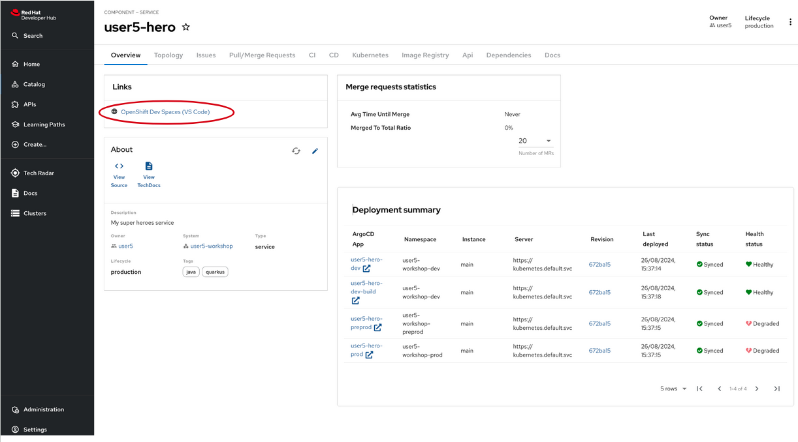

# Creating the Villain Microservice

New microservice, new project! 
In this section we will see the counterpart of the Hero microservice: the Villain microservice.
The Villain REST Endpoint is really similar to the Hero Endpoint but has been developed using the Spring compatibility layer provided by Quarkus.
The Quarkus Spring compatibility extensions map Spring APIs to APIs in existing extensions that have already been optimized for fast startup, reduced memory utilization and native compilation, like RestEasy and CDI.
While users are encouraged to use Quarkus extensions, this compatibility layer is provided to make developing new applications with Quarkus a natural getting started experience.
Be aware that Quarkus Spring compatibility extensions do not utilize the Spring application context. 
For this reason, attempting to utilize additional Spring libraries will likely not work.

## Bootstrapping the Villain Rest Endpoint

The code is now fully available and you will not have to write any of this microservice.
To set up the project, simply create it from the specified template, which will automatically pull the complete code from the GitHub repository.

### Red Hat Developer Hub Software templates and Dev Spaces workspace.

Like the Hero microservice creation, to create a Dev Spaces (DS) workspace, you'll first need to create a _Software Component_ using a _Red Hat Developer Hub (RHDH) Software Template_:

1. Navigate to the _Create Option_: in the left-hand menu of the RHDH, click on the "Create" option.
1. Select the template: you'll see a list of available templates. Choose the `OpenCodeQuest - Quarkus microservice with Spring MVC and Spring Data` template from the list.
1. Configure the workspace: after selecting the template, you'll need to provide the necessary values for clusters and other configurations. Most of these fields will be pre-filled by default, so you may only need to make minor adjustments if necessary.
1. Proceed with the setup: Once you've reviewed the configurations, proceed to create your DS workspace.

Once created, the component is available in the _catalog_.
You can access it to have an overview:



Launch the Dev Spaces creation by clicking the link OpenShift Dev Spaces (VS Code).

## The Villain Service

At the heart of the Super Hero application come also  _villains_.

We need to expose a REST API allowing CRUD operations on _super heroes_.
This microservice is also a *classical* microservice.
It uses HTTP to expose a REST API, and it internally stores data into a database.

This service will be used by the *fight* microservice.

In the following sections, you will learn:

* how to implement REST API using Quarkus Spring web extension, and
* how to compose your application using CDI beans injected with Quarkus Spring CDI, and
* how to access your database using Quarkus Spring Data JPA, and
* how to use transactions, and

## Directory Structure

Once you bootstrap the project, you get the following directory structure with a few Java classes and other artifacts:


It generates the following in the `villain-service` folder:

* the Maven structure with a `pom.xml`
* an `io.quarkus.workshop.villain.VillainController` controller exposed on `/api/heroes`
* an associated unit test `VillainControllerTest`
* example `Dockerfile` files for both native and jvm modes in `src/main/docker`
* the `application.properties` configuration file

Once generated, look at the `pom.xml`.
You will find the here import of the Quarkus BOM (_bill of materials_), allowing you to omit the version on the different Quarkus dependencies.
In addition, you can see the `quarkus-maven-plugin`, responsible for the packaging of the application and also providing the development mode support.

If we focus on the dependencies section, you can see basically the same dependencies than the hero-service plus the `quarkus-spring-web` and `quarkus-spring-data`

## The Controller

During the project creation, the `VillainController.java` file has been created with the following content:

```java linenums="1"
{{ insert('villain-service/src/main/java/io/quarkus/workshop/villain/VillainController.java') }}
```

It's a very simple REST endpoint, returning "hello" to HTTP GET requests to `/api/heroes`.

This controller exposes CRUD operations to "villains" and leverages Spring Web and Spring Data JPA annotations for handling HTTP requests and transactions:

1. **@RestController**: Marks the class as a RESTful controller where every method returns a JSON response instead of a view. 

2. **@RequestMapping**: Specifies the base URL path (`/api/villains`) for all the endpoints within this controller. It replaces the standard JAX-RS `@Path`

3. **@GetMapping, @PostMapping, @PutMapping, @DeleteMapping**: These annotations define HTTP methods (GET, POST, PUT, DELETE) to map specific endpoints to CRUD operations.

Not Spring specific annotations but used like in the hero-service:

4. **@Transactional**: Ensures that the methods annotated with it are executed within a transaction context, which automatically commits or rolls back the transaction.

5. **@Valid**: Validates the input entity (`Villain`) based on the constraints defined on its fields.

6. **@Context**: Injects `UriInfo`, which provides contextual information about the current URI to help in creating new URIs for created resources.

7. **@RunOnVirtualThread**: Runs the controller on a virtual thread for better concurrency management. This is specific to the SmallRye library.

## Accessing Database

As everything is in place the `import.sql` file contains already all SQL statements to populate the villain database.

### The Villain repository

As we are following a Spring Data programming model with JPA,we need to extend the JPA specific Repository interface, JpaRepository. 
This will enable Quarkus to find this interface and automatically create an implementation for it.
By extending the interface, we get the most relevant CRUD methods automatically. 

You can check the `VillainRepository.java` code. It also contains a more specific method to retrieve a villain randomly from database:

```java linenums="1"
{{ insert('villain-service/src/main/java/io/quarkus/workshop/villain/VillainRepository.java', 'springSpecificMethod') }}
```

### The Villain entity

Finally we have an entity class representing the villains.

```java linenums="1"
{{ insert('villain-service/src/main/java/io/quarkus/workshop/villain/Villain.java') }}
```

### Tests

As in the case of the heroes, the tests could not be missing here. 
A test class is provided and contains the basic tests to ensure that the villain microservice works correctly.

You can check that everything works fine by starting the application in development mode.

run one of the following commands:

`./mvnw quarkus:dev`

or

`quarkus dev`

```shell

```

Note that the tests have been successful run. 

Alternatively, you can open `/api/villains` in your browser and you should get lots of villains.

## Deploy the Villain microservice

To deploy the Villain service, remember to perform a commit&push of the code. You can get some help [here](from-git-to-openshif.md)