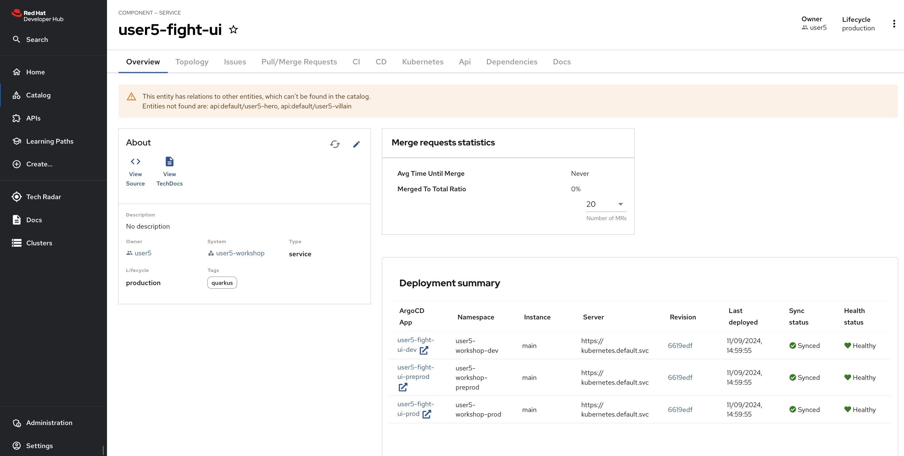

The first thing we are going to do to familiarise ourselves with the framework and tools such as Red Hat Developer Hub and Dev Spaces is to create the UI.

## The Web Application

This application exposes the user interface to make the fight.

The user interface is written in _JavaScript_ using _React_, and the compiled assets are exposed from a _Quarkus_ microservice.

The application also performs some service composition logic, as it makes HTTP client requests to the _heroes_, _villains_ and _fight_ services:

## Bootstrapping the Web Application Endpoint

Once logged in the Red Hat Developer Hub, please proceed with following steps:

* ==Navigate to the _Create Option_: in the left-hand menu of the RHDH, click on the "Create" option==.

* ==Select the template: you'll see a list of available templates. Choose the `OpenCodeQuest - Fight-UI service` template from the list which will automatically pull the complete code from the GitHub repository.==

* ==Select your cluster name, check the reference in the current url. The rest of the fields will be pre-filled by default==.

* ==Click Next/Review button until a summary is shown==

* ==Review the configuration. Then, click on `Create`==.

* ==If everything went well, you should see the following successful page. Click on the `Open Component in Catalog`==:

-   :warning:{ .lg .middle }:warning:{ .lg .middle } __Entities not found warning__ :warning:{ .lg .middle }:warning:{ .lg .middle }

    ---

    The warning you're seeing is expected because the web application relies on several microservices—Hero, Villain, and Fight—which haven't been deployed yet.Once the entire system is up and running, the message will no longer appear.

==Go to the Topology tab==

==Here you can find the three ui-fight instances deployed in the three environments available: dev, preprod and production.==

==Click in the little arrow symbol that allows you to navigate to the ui url in a browser==.

==You should see something like:==

==Again, the errors you see are due to the absence of the backend microservices.==

==Once they will be in place, you will see something like:==

