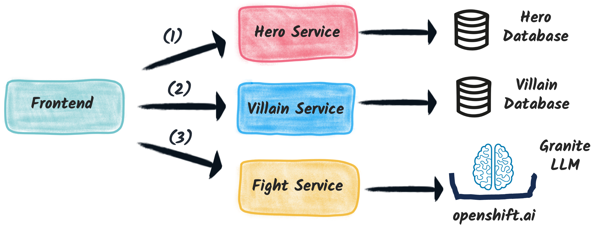

## The Web Application

This application exposes the user interface to make the fight.

The user interface is written in _JavaScript_ using _React_, and the compiled assets are exposed from a _Quarkus_ microservice.

The application also performs some service composition logic, as it makes HTTP client requests to the _heroes_, _villains_ and _fight_ services:

## Bootstrapping the Web Application Endpoint

The code is now fully available and you will not have to write any of this microservice.

To set up the project, simply create it from the `OpenCodeQuest - Fight-UI service` template, which will automatically pull the complete code from the GitHub repository.

## Setting up environment variables

The service needs the following 3 environment variables to point to the heroes, villains and fight services:

- `ENDPOINTS_HEROES` (e.g., `http://user2-hero-dev:8080/api/heroes/random`)
- `ENDPOINTS_VILLAINS` (e.g., `http://user2-villain-dev:8080/api/villains/random`)
- `ENDPOINTS_FIGHT` (e.g., `http://user2-fight-dev:8080/api/fights`)
